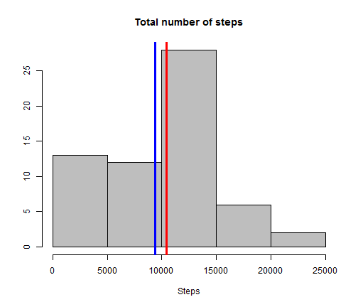
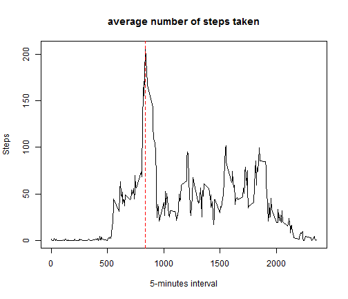
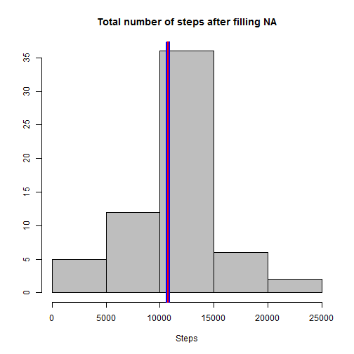
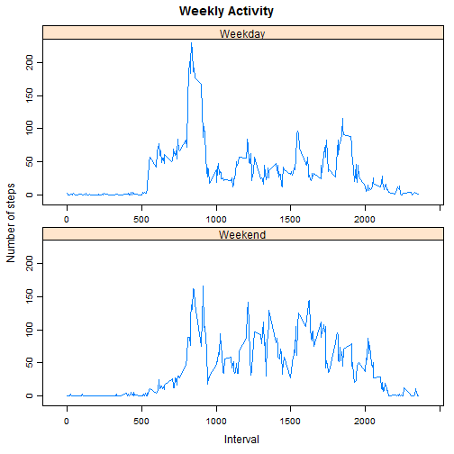

# Reproducible Research: Peer Assessment 1


## Introduction
This assignment makes use of data from a personal activity monitoring device. This device collects data at 5 minute intervals through out the day. The data consists of two months of data from an anonymous individual collected during the months of October and November, 2012 and include the number of steps taken in 5 minute intervals each day.
## Data Description
The data for this assignment can be downloaded from the course web site:
*  Dataset: [Activity monitoring data][1] [52K]  
  
The variables included in this dataset are:
*	steps: Number of steps taking in a 5-minute interval (missing values are coded as NA)
*	date: The date on which the measurement was taken in YYYY-MM-DD format
*	interval: Identifier for the 5-minute interval in which measurement was taken
The dataset is stored in the working directory in a comma-separated-value (CSV) file and there are a total of 17,568 observations in this dataset.    
[1]: https://d396qusza40orc.cloudfront.net/repdata%2Fdata%2Factivity.zip "Activity monitoring data"

## Loading and preprocessing the data

Setting Global Options

```r
opts_chunk$set(echo = TRUE, results = "asis")
```


Reading Data

```r
## setwd('C:/Data Scientist/5-Reproducible Research/Assignment 1')
activity <- read.csv("./activity.csv", colClasses = c("numeric", "factor", "character"))
```


Processing/Transforming Data : adding weekday variable  values (1=YES  ; 0=NO)

```r
datetime <- as.Date(activity$date)
weekday <- ifelse((format(datetime, format = "%w") == 0 | format(datetime, format = "%w") == 
    6), "Weekend", "Weekday")
activity <- data.frame(cbind(activity, weekday))
```


## What is mean total number of steps taken per day?
* Mean = blue line
* Median = red line


```r

# 1. Histogram of the total number of steps taken each day
steps_sum <- tapply(activity$steps, activity$date, sum, na.rm = TRUE)
steps_sum <- data.frame(cbind(steps_sum[]))
names(steps_sum) <- c("sum_value")
hist(steps_sum$sum_value, xlab = "Steps", ylab = "", col = "grey", main = "Total number of steps")

# 2. Reporting the mean : blue
abline(v = mean(steps_sum$sum_value), col = "blue", lwd = 3)

# 3. Reporting the median : red
abline(v = median(steps_sum$sum_value), col = "red", lwd = 3)
```

 


## What is the average daily activity pattern?

* 5-minute interval that, on average, contains the maximum number of steps = red line


```r
f <- activity$interval
activity_mean <- tapply(activity$steps, f, mean, na.rm = TRUE)
activity_mean <- data.frame(cbind(as.numeric(row.names(activity_mean[])), activity_mean[]))
names(activity_mean) <- c("interval", "mean_value")
interval <- as.numeric(unique(f))
steps <- rep(0, length(interval))
for (i in 1:length(interval)) steps[i] <- activity_mean[activity_mean$interval == 
    interval[i], ]$mean_value
activityMeanSteps <- data.frame(interval = interval, steps = steps)
with(activityMeanSteps, {
    plot(interval, steps, type = "l", ylab = "Steps", xlab = "5-minutes interval", 
        main = "average number of steps taken")
})
interval_max <- activityMeanSteps[activityMeanSteps$steps == max(activityMeanSteps$steps), 
    ][, ]$interval
abline(v = interval_max, col = "red", lwd = 1, lty = 2)
```

 


## Imputing missing values

### Reporting number of missing values


```r

# Total missing values
length(activity$steps) - length(activity[complete.cases((activity$steps)), ]$steps)
```

[1] 2304

### Strategy for filling missing values
Each steps missing value will be replaced by the mean value of that 5-minute intervale  

### Creating a new dataset with missing values filled


```r
activityNaFilled <- activity
for (i in 1:length(activityNaFilled$steps)) {
    if (is.na(activityNaFilled[i, ]$steps)) 
        (activityNaFilled[i, ]$steps <- activityMeanSteps[activityNaFilled[i, 
            ]$interval == activityMeanSteps$interval, ]$steps)
}
```

## Total number of steps taken per day
* Mean = blue line
* Median = red line


```r

# 1. Histogram of the total number of steps taken each day
steps_sum <- tapply(activityNaFilled$steps, activityNaFilled$date, sum, na.rm = TRUE)
steps_sum <- data.frame(cbind(steps_sum[]))
names(steps_sum) <- c("sum_value")
hist(steps_sum$sum_value, xlab = "Steps", ylab = "", col = "grey", main = "Total number of steps after filling NA")

# 2. Reporting the mean : blue
abline(v = mean(steps_sum$sum_value), col = "blue", lwd = 6)

# 3. Reporting the median : red
abline(v = median(steps_sum$sum_value), col = "red", lwd = 2)
```

 


## Are there differences in activity patterns between weekdays and weekends?


```r
weekend <- unique(activityNaFilled[activityNaFilled$weekday == "Weekend", ][, 
    ])
weekday <- unique(activityNaFilled[activityNaFilled$weekday == "Weekday", ][, 
    ])

## Weekend Data Process
f <- weekend$interval
activity_mean <- tapply(weekend$steps, f, mean, na.rm = TRUE)
activity_mean <- data.frame(cbind(as.numeric(row.names(activity_mean[])), activity_mean[]))
names(activity_mean) <- c("interval", "mean_value")
interval <- as.numeric(unique(f))
steps <- rep(0, length(interval))
week <- rep("Weekend", length(interval))
for (i in 1:length(interval)) steps[i] <- activity_mean[activity_mean$interval == 
    interval[i], ]$mean_value
activity_mean1 <- data.frame(interval = interval, steps = steps, week)

## Weekday Data Process
f <- weekday$interval
activity_mean <- tapply(weekday$steps, f, mean, na.rm = TRUE)
activity_mean <- data.frame(cbind(as.numeric(row.names(activity_mean[])), activity_mean[]))
names(activity_mean) <- c("interval", "mean_value")
interval <- as.numeric(unique(f))
steps <- rep(0, length(interval))
week <- rep("Weekday", length(interval))
for (i in 1:length(interval)) steps[i] <- activity_mean[activity_mean$interval == 
    interval[i], ]$mean_value
activity_mean2 <- data.frame(interval = interval, steps = steps, week)

## Merge and plot
week_mean <- data.frame(rbind(activity_mean1, activity_mean2))
library("lattice")
xyplot(steps ~ interval | week, data = week_mean[complete.cases(week_mean), 
    ][, ], scales = "free", layout = c(1, 2), type = "l", ylab = "Number of steps", 
    xlab = "Interval", ylim = c(0, 220), main = "Weekly Activity")
```

 

